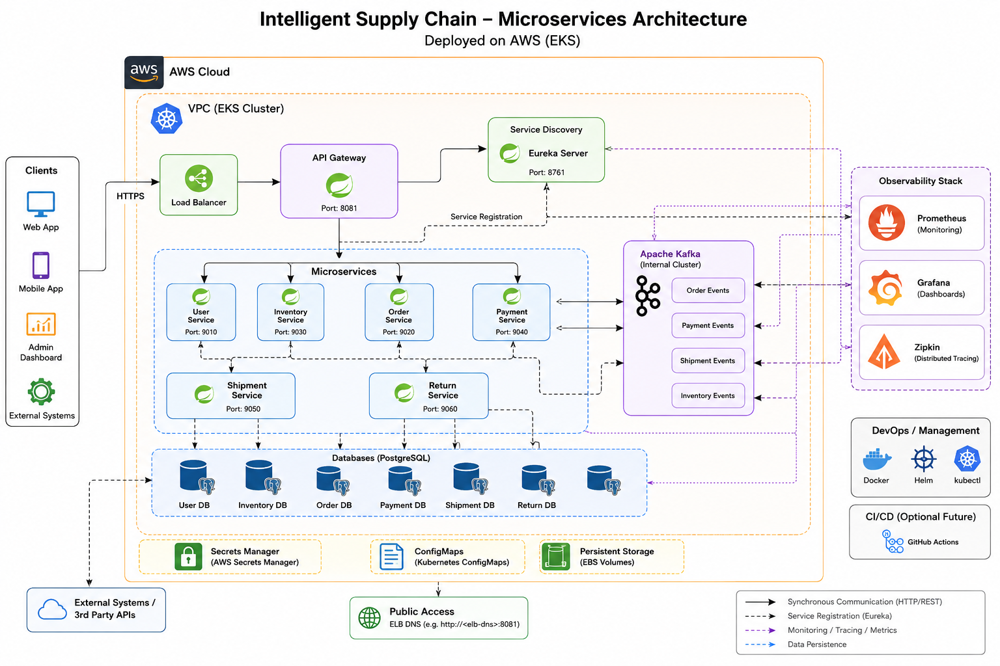

# Intelligent Supply Chain Platform 🚀

A cloud-native, event-driven microservices platform built to simulate how modern distributed supply chain systems operate internally.

This project focuses on:
- Distributed Systems
- Event-Driven Architecture
- Kubernetes Orchestration
- Cloud Deployment on AWS EKS
- Observability & Monitoring
- Production-style Infrastructure

The platform was first deployed locally using Minikube for Kubernetes testing/debugging and later deployed on AWS EKS.

---

# 📌 Architecture Overview

## Core Components

- Spring Boot Microservices
- Apache Kafka Event Streaming
- PostgreSQL Database per Service
- Eureka Service Discovery
- API Gateway
- Dockerized Infrastructure
- Kubernetes Deployments
- AWS EKS Deployment
- Helm Packaging
- Prometheus Monitoring
- Grafana Dashboards
- Zipkin Distributed Tracing

---

# 🧩 Microservices


| Service | Responsibility |
|---|---|
| User Service | Manages users |
| Order Service | Creates and manages orders |
| Inventory Service | Handles product inventory |
| Payment Service | Processes payments |
| Shipment Service | Manages shipment workflows |
| Return Service | Handles product returns |
| API Gateway | Central entry point |
| Discovery Server | Eureka-based service discovery |

---

# ⚡ Event-Driven Workflow

```text
Client Request
      ↓
API Gateway
      ↓
Order Service
      ↓
Kafka Event: OrderCreatedEvent
      ↓
Payment Service
      ↓
Kafka Event: PaymentProcessedEvent
      ↓
Shipment Service
```

---

# 🛠️ Tech Stack

## Backend
- Java 21
- Spring Boot
- Spring Cloud
- Spring Data JPA
- Spring Cloud Gateway
- Eureka Discovery Server

## Messaging
- Apache Kafka

## Database
- PostgreSQL

## DevOps & Cloud
- Docker
- Kubernetes
- Minikube
- AWS EKS
- Helm

## Observability
- Prometheus
- Grafana
- Zipkin

---

# ☁️ Kubernetes Deployment


## Local Deployment
- Minikube
- Kubernetes Services
- Ingress
- Configurations & Secrets
- 


## Cloud Deployment
- AWS EKS Cluster
- AWS LoadBalancer
- Kubernetes Deployments
- Service Networking
- Public Access via AWS ELB

---

# 📊 Observability Stack

## Prometheus
- JVM Metrics
- Request Monitoring
- CPU & Memory Metrics

## Grafana
- Dashboard Visualization
- Service Monitoring
- Infrastructure Metrics

## Zipkin
- Distributed Tracing
- Request Flow Visualization
- Inter-service Communication Tracking

---

# ☸️ Kubernetes Features Used

- Deployments
- Services
- Namespaces
- ConfigMaps
- Secrets
- Ingress
- LoadBalancer
- Helm Charts
- Pod Networking
- Service Discovery

---

# 📂 Project Structure

```text
intelligent-supply-chain/
│
├── api-gateway/
├── discovery-server/
├── user-service/
├── order-service/
├── inventory-service/
├── payment-service/
├── shipment-service/
├── return-service/
├── shared-kafka-events/
│
├── k8s/
├── intelligent-supply-chain-chart/
└── screenshots/
```



---

# 🚀 Running the Project

## Clone Repository

```bash
git clone https://github.com/98001yash/intelligent-supply-chain.git
cd intelligent-supply-chain
```

## Docker Compose

```bash
docker-compose up -d
```

## Minikube Deployment

```bash
minikube start
minikube addons enable ingress
kubectl apply -R -f k8s/
```

## AWS EKS Deployment

```bash
aws configure
```

```bash
eksctl create cluster \
--name intelligent-supply-chain \
--region ap-south-1 \
--nodegroup-name workers \
--node-type t3.medium \
--nodes 2
```

```bash
kubectl apply -R -f k8s/
```

---

# 📈 Observability Access

## Grafana

```bash
kubectl port-forward svc/grafana 3000:3000 -n intelligent-supply-chain
```

## Zipkin

```bash
kubectl port-forward svc/zipkin 9411:9411 -n intelligent-supply-chain
```

## Eureka Dashboard

```bash
kubectl port-forward svc/discovery-server 8761:8761 -n intelligent-supply-chain
```

---

# 🔥 Key Learnings

This project provided hands-on experience with:

- Distributed Systems Architecture
- Event-Driven Communication
- Kafka-based Workflows
- Kubernetes Networking
- AWS EKS Infrastructure
- Dockerized Deployments
- Observability Engineering
- Distributed Tracing
- Cloud-native System Design
- Microservices Communication
- Debugging Production-style Failures

---

# 🔮 Future Improvements

- AI-driven anomaly detection
- Predictive inventory intelligence
- Real-time analytics
- Advanced scaling experiments
- CI/CD automation
- Security hardening

---

# 📎 GitHub Repository

Repository:
https://github.com/98001yash/intelligent-supply-chain

---

# 🙌 Final Note

This project was built to deeply understand how modern distributed systems, Kubernetes infrastructure, observability tooling, and event-driven microservices work together in real production-style environments.
